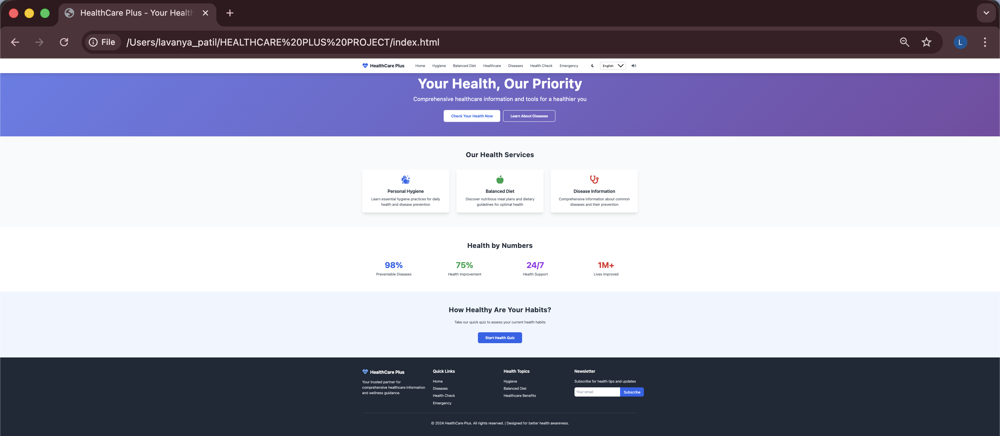
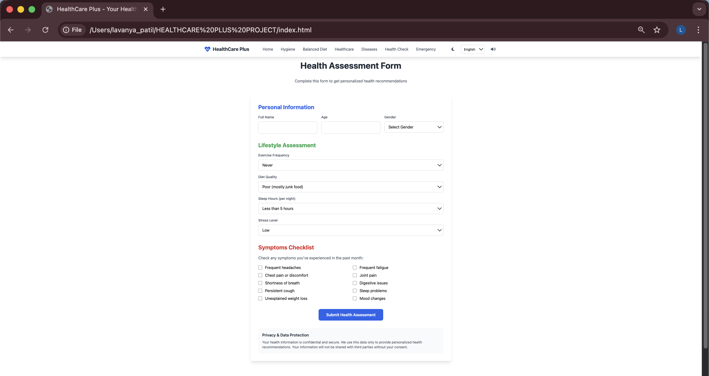
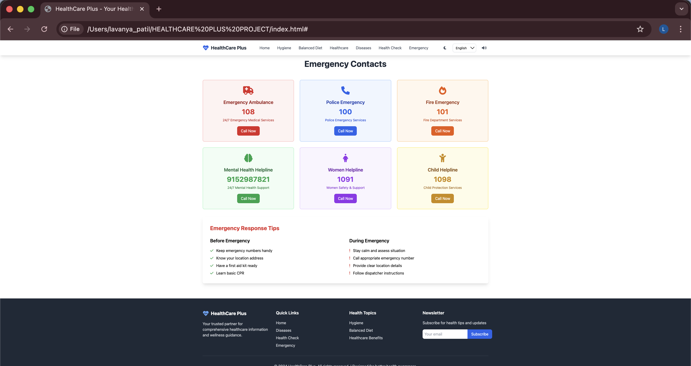

# 🏥 HealthCare Plus – Healthcare Awareness Web Application

A responsive healthcare awareness website built using HTML, Tailwind CSS, and JavaScript.

🔗 Live Demo: https://lavanyapatil274.github.io/HEALTHCARE-PLUS-PROJECT/

---

## 📌 Project Overview

HealthCare Plus is an interactive web application designed to spread awareness about:

- Personal & Public Hygiene
- Balanced Diet & Nutrition
- Common Diseases Information
- Health Assessment Form
- Emergency Contacts

The website is fully responsive and user-friendly.

---

## 🚀 Features

✅ Multi-page navigation (Single Page Application style)  
✅ Health Assessment Form  
✅ Interactive Health Quiz  
✅ Dark Mode Toggle  
✅ Disease Information Modal  
✅ Emergency Contact Section  
✅ Mobile Responsive Design  

---

## 🛠️ Technologies Used

- HTML5
- Tailwind CSS
- JavaScript
- Font Awesome Icons

---

## 📷 Screenshots

### 🏠 Home Page

### 🦠 Disease Section

### 📋 Health Assessment Form

### 🚨 Emergency Section

---

## 🎯 Learning Outcomes

- Implemented responsive UI design
- Built interactive JavaScript-based features
- Developed health awareness content structure
- Used Tailwind CSS for modern styling
- Practiced SPA-like page switching logic

---

## 👩‍💻 Author

Lavanya Patil  
B.E Computer Engineering Student  
Dr. D. Y. Patil Institute of Technology, Pimpri, Pune
